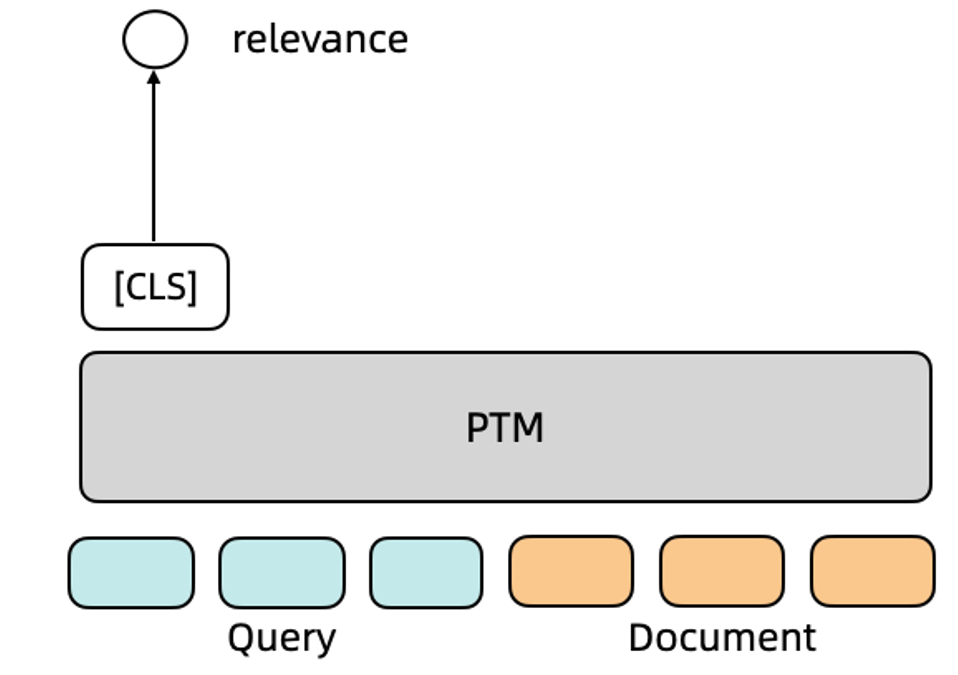

---
tasks:
- text-ranking
widgets:
  - task: text-ranking
    model_revision: v1.2.0
    inputs:
      - type: text
        name: source_sentence
      - type: text-list
        name: sentences_to_compare
    examples:
      - name: 示例1
        inputs:
          - data:
            - 上消化道出血手术大约多久
          - data: 
            - 上消化道出血手术大约要2-3个小时左右。手术后应观察血压、体温、脉搏、呼吸的变化。污染被服应随时更换，以避免不良刺激。出血停止后按序给予温凉流质、半流质及易消化的软饮食。
            - 胃出血一般住院30-60天。胃出血一般需要住院的时间需要注意根据情况来看，要看是胃溃疡引起，还是有无肝硬化门静脉高压引起的出血的情况，待消化道出血完全停止后病情稳定就可以出院，因此住院时间并不固定。
      - name: 示例2
        inputs:
          - data:
            - 大葱鲜姜紫菜汤治疗冠心病,汤里放盐吗?
          - data: 
            - 冠心病患者应避免辛辣刺激，大葱和生姜都有一定的刺激性。然后对盐的摄入应保持在每天5~10克之间。
            - 冠心病就是所谓的心脏病的一种。饮食主要是少吃油腻的，低盐饮食。
            - 盐开水有一定的消炎作用。
      - name: 示例3
        inputs:
          - data:
            - 孩子嘴里擦紫药水产生副作用了怎么办呢
          - data: 
            - 病例分析:不要紫药水，有问题不好观察，现在不主张用。停药就好了。意见建议:多用白水漱口。
            - 给宝宝服药治疗期间要注意饮食调理，多喝温开水，忌食辛辣刺激油腻生冷的饮食，不要喝碳酸饮料
            - 你好，你孩子的情况考虑是消化不好引起的，建议服用鞣酸蛋白，胶囊治疗。
      - name: 示例4
        inputs:
          - data:
            - 全身肌肉无力是挂神经内科还是免疫内科？
          - data: 
            - 先挂神经内科查找无力原因。
            - 若是和外伤或占位性疾患的情况是属于神经外科，而其他情况是内科。
            - 强直性脊柱炎是风湿免疫病的一种。往往是到风湿免疫科看病的。
model-type:
- bert
domain:
- nlp
framworks:
- pytorch
backbone:
- transformer
language:
- zh
containers:
- registry-vpc.cn-shanghai.aliyuncs.com/cloud-dsw/pytorch:1.8-cpu-py36-ubuntu18.04
metrics:
- mrr@10
- ndcg@10
tags:
- Chinese Passage Ranking
- Transformer
- text ranking
- BERT
- ROM
- CoROM
- 语义相关性
- 句子相似度
- 信息检索
- 检索
- 匹配
- 相似度
- 排序
- Rank
- Retrieval
- Rerank
- 语义匹配
- 搜索
- 文本匹配
- 电商

customized-quickstart: True
finetune-support: True
license: Apache License 2.0

---

# ROM语义相关性-中文-医疗领域模型介绍

文本检索是信息检索领域的核心问题, 其在很多信息检索、NLP下游任务中发挥着非常重要的作用。 近几年, BERT等大规模预训练语言模型的出现使得文本表示效果有了大幅度的提升, 基于预训练语言模型构建的文本检索系统在召回、排序效果上都明显优于传统统计模型。

由于文档候选集合通常比较庞大，实际的工业搜索系统中候选文档数量往往在千万甚至更高的数量级, 为了兼顾效率和准确率，目前的文本检索系统通常是基于召回&排序的多阶段搜索框架。在召回阶段，系统的主要目标是从海量文本中去找到潜在跟query相关的文档，得到较小的候选文档集合（100-1000个）。召回完成后, 排序阶段的模型会对这些召回的候选文档进行更加复杂的排序, 产出最后的排序结果。 本模型为基于预训练的排序阶段模型。


## 模型描述

本模型为基于ROM-Base预训练模型在[Multi-CPR](https://github.com/Alibaba-NLP/Multi-CPR)医疗数据训练的医疗领域中文语义相关性模型，模型以一个source sentence以及一个句子列表作为输入，最终输出source sentence与列表中每个句子的相关性得分（0-1，分数越高代表两者越相关）。


<div align=center></div>

### 期望模型使用方式以及适用范围
本模型主要用于给输入中文查询与文档列表产出相关性分数。用户可以自行尝试输入查询和文档。具体调用方式请参考代码示例。本模型使用[Multi-CPR](）医疗数据进行训练，对于其他领域数据有可能产生一些偏差，请用户自行评测后决定如何使用。

### 如何使用
在安装ModelScope完成之后即可使用语义相关性模型, 该模型以一个source sentence以及一个“sentence_to_compare"（句子列表）作为输入，最终输出source sentence与列表中每个句子的相关性得分（0-1，分数越高代表两者越相关）。 默认每个句子对长度不超过512。

#### 代码范例
```
# 可在CPU/GPU环境运行
from modelscope.models import Model
from modelscope.pipelines import pipeline
# Version less than 1.1 please use TextRankingPreprocessor
from modelscope.preprocessors import TextRankingTransformersPreprocessor
from modelscope.utils.constant import Tasks

inputs = {
    'source_sentence': ["上消化道出血手术大约多久"],
    'sentences_to_compare': [
        "上消化道出血手术大约要2-3个小时左右。手术后应观察血压、体温、脉搏、呼吸的变化。污染被服应随时更换，以避免不良刺激。出血停止后按序给予温凉流质、半流质及易消化的软饮食。",
        "胃出血一般住院30-60天。胃出血一般需要住院的时间需要注意根据情况来看，要看是胃溃疡引起，还是有无肝硬化门静脉高压引起的出血的情况，待消化道出血完全停止后病情稳定就可以出院，因此住院时间并不固定",
    ]
}
model_id = 'damo/nlp_corom_passage-ranking_chinese-base-medical'
pipeline_ins = pipeline(task=Tasks.text_ranking, model=model_id,model_revision='v1.2.0')
result = pipeline_ins(input=inputs)
print (result)
# {'scores': [0.9999668002128601, 0.00022766203619539738]}
```

### 模型局限性以及可能的偏差
本模型基于中文公开语义相关性数据集[Multi-CPR数据集](https://github.com/Alibaba-NLP/Multi-CPR)医疗领域数据进行训练，在其他垂类领域上的排序效果会有降低，请用户自行评测后决定如何使用。

## 模型训练

### 训练流程
- 模型: 单塔篇章排序模型, 采用coROM模型作为预训练语言模型底座
- 训练数据: 本模型采用来自[Multi-CPR数据集](https://github.com/Alibaba-NLP/Multi-CPR)的中文医疗领域数据标注训练。

模型采用4张NVIDIA V100机器训练, 主要超参设置如下: 
```
train_epochs=10
max_sequence_length=128                                                                                                                                                      
batch_size=64
learning_rate=3e-5
optimizer=AdamW                                                                                                                                                              
neg_samples=8
```
### 训练示例代码

```python
# 需在GPU环境运行
# 加载数据集过程可能由于网络原因失败，请尝试重新运行代码
from modelscope.metainfo import Trainers                                                                                                                                                              
from modelscope.msdatasets import MsDataset
from modelscope.trainers import build_trainer
import tempfile
import os

tmp_dir = tempfile.TemporaryDirectory().name
if not os.path.exists(tmp_dir):
    os.makedirs(tmp_dir)

# load dataset
ds = MsDataset.load('dureader-retrieval-ranking', 'zyznull')
train_ds = ds['train'].to_hf_dataset()
dev_ds = ds['dev'].to_hf_dataset()
model_id = 'damo/nlp_rom_passage-ranking_chinese-base-medical'
def cfg_modify_fn(cfg):
    cfg.task = 'text-ranking'
    cfg['preprocessor'] = {'type': 'text-ranking'}
    cfg['dataset'] = {
        'train': {
            'type': 'bert',
            'query_sequence': 'query',
            'pos_sequence': 'positive_passages',
            'neg_sequence': 'negative_passages',
            'text_fileds': ['text'],
            'qid_field': 'query_id'
        },
        'val': {
            'type': 'bert',
            'query_sequence': 'query',
            'pos_sequence': 'positive_passages',
            'neg_sequence': 'negative_passages',
            'text_fileds': ['text'],
            'qid_field': 'query_id'
        },
    }
    cfg['train']['neg_samples'] = 4
    cfg['evaluation']['dataloader']['batch_size_per_gpu'] = 30
    cfg.train.max_epochs = 1
    cfg.train.train_batch_size = 4
    cfg.train.hooks = [{
        'type': 'TextLoggerHook',
        'interval': 1
    }, {
        'type': 'IterTimerHook'
    }, {
        'type': 'EvaluationHook',
        'by_epoch': False,
        'interval': 1000
    }]
    return cfg 
kwargs = dict(
    model=model_id,
    train_dataset=train_ds,
    work_dir=tmp_dir,
    eval_dataset=dev_ds,
    cfg_modify_fn=cfg_modify_fn)
trainer = build_trainer(name=Trainers.nlp_text_ranking_trainer, default_args=kwargs)
trainer.train()
```

## 数据评估及结果
本模型在MultiCPR医疗数据上使用[CoROM文本向量-中文-医疗领域-base](https://modelscope.cn/models/damo/nlp_corom_sentence-embedding_chinese-base-medical/summary)(CoROM-Retrieval)模型召回的top100结果上重排序效果如下:

| Model      | MRR@10 |
|------------|--------|
| CoROM-Retrieval-base   |  32.70  |
| CoROM-Ranking-base    |  50.90  |
| CoROM-Retrieval-tiny   |  22.78  |
| CoROM-Ranking-tiny|    48.63     |


## 引用
如果你觉得这个该模型对有所帮助，请考虑引用下面的相关的论文：

```BibTeX
@article{Long2022MultiCPRAM,
  title={Multi-CPR: A Multi Domain Chinese Dataset for Passage Retrieval},
  author={Dingkun Long and Qiong Gao and Kuan Zou and Guangwei Xu and Pengjun Xie and Rui Guo and Jianfeng Xu and Guanjun Jiang and Luxi Xing and P. Yang},
  booktitle = {Proceedings of the 45th International ACM SIGIR Conference on Research and Development in Information Retrieval},
  series = {SIGIR 22},
  year={2022}
}
```
#### Clone with HTTP
```bash
 git clone https://www.modelscope.cn/damo/nlp_corom_passage-ranking_chinese-base-medical.git
```

