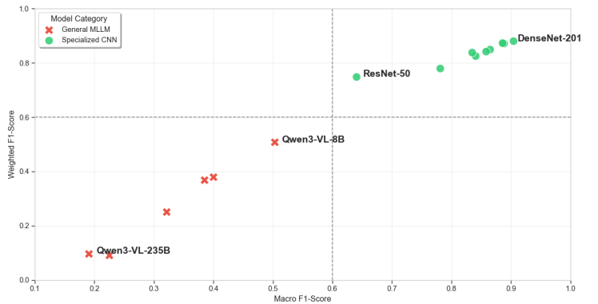
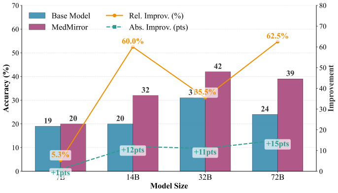
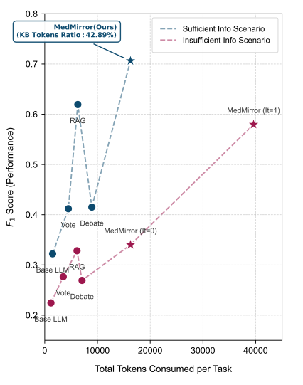

# MedMirror: Extended Experiments & Supplementary Results

This document provides supplementary experimental results that were omitted from the main manuscript due to space constraints. It includes detailed analyses on tongue diagnosis model comparisons, architectural scalability, cross-domain adaptability, and cost-efficiency.

## 1. Tongue Diagnosis Model Comparison

As illustrated in Fig 1, specialized CNNs markedly outperform general MLLMs in fine-grained tongue image classification. While DenseNet-201 achieves peak performance, MLLMs exhibit severe zero-shot degradation, a phenomenon that paradoxically worsens with increased parameter scale (e.g., Qwen3-VL-235B). This disparity highlights the superior capability of CNNs in capturing subtle micro-textures and mitigating the visual semantic drift prevalent in MLLMs. Consequently, we propose a decoupled cascaded architecture utilizing DenseNet-201 as a front-end visual extractor to provide a reliable, high-fidelity foundation for subsequent reasoning.

*Fig 1. Performance Comparison of General MLLMs and Specialized CNNs in Tongue Image Classification.*

---

## 2. Scalability Analysis

As illustrated in Fig 2, scalability evaluations on the Qwen2.5 series demonstrate that MedMirror consistently improves diagnostic accuracy across diverse parameter scales. Beyond achieving peak performance with the 32B variant, the framework effectively rectifies the anomalous performance degradation observed in the unenhanced 72B model. This consistent enhancement confirms that MedMirror is highly scalable and uniquely capable of unlocking latent domain knowledge embedded within larger architectures.

*Fig 2. Scalability analysis of MedMirror versus the Qwen 2.5 base models on TCMEval-SDT.*

---

## 3. Cross-Domain Evaluation

As shown in Table 1, MedMirror demonstrates architectural adaptability on the Western Medicine CMB benchmark, elevating MCQ accuracy from 0.8727 to 0.9158. In Clinical QA tasks, performance slightly regresses under the idealized "Full Description" setting due to information saturation, where redundant active inquiry introduces noise into already complete records. Crucially, under the ecologically valid "Only Chief Complaint" setting, passive baseline generation collapses (0.3802). Conversely, a single iteration of the READ-Loop systematically bridges evidentiary gaps, recovering accuracy to 0.6833. These results confirm that MedMirror trades marginal performance in artificial, information-rich contexts for critical diagnostic resilience in real-world clinical scenarios characterized by high uncertainty.

**Table 1. Cross-domain evaluation results on the CMB benchmark**

| Task | Methods | Accuracy |
| :--- | :--- | :--- |
| **Multiple choice question** | DeepSeek-V3  Ours(DeepSeek-V3) | 0.8727  0.9158 |
| **Clinical QA(Full Description)** | DeepSeek-V3  Ours(DeepSeek-V3) | 0.8472  0.7968 |
| **Clinical QA(Only Chief Complaint)** | DeepSeek-V3  Ours(DeepSeek-V3, READ-Loop iter=1) | 0.3802  0.6833 |

---

## 4. Cost-Efficiency Analysis

As illustrated in Fig 3, MedMirror necessitates a strategic trade-off between computational overhead and diagnostic precision. While incurring a higher token consumption than standard retrieval-augmented approaches, the framework delivers substantial performance dividends across diverse clinical scenarios. Crucially, in information-sparse settings where traditional RAG yields only marginal improvements, MedMirror effectively prevents model collapse. This performance differential highlights a necessary paradigm shift from fast-thinking retrieval to a slow-thinking reflective architecture. Given the high stakes of clinical misdiagnosis, prioritizing diagnostic reliability over inference latency proves indispensable.

*Fig 3. Cost-Efficiency analysis of MedMirror. KB Tokens Ratio represents the average proportion of tokens allocated to the MedMirror external knowledge base per reasoning task.*